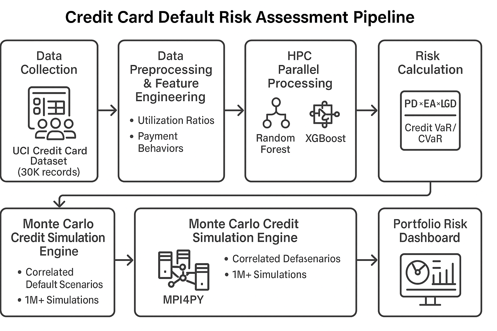
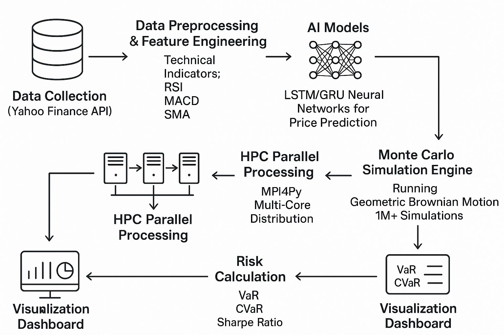

# AI-Enhanced Monte Carlo Simulation for Financial Risk Assessment

## Quick Start Guide

### Prerequisites

- Python 3.8+
- MPI installation for HPC features (optional)

### Installation

1. **Clone the repository**

   ```bash
   git clone https://github.com/satyakarthikeya/AI-Enhanced-Monte-Carlo-Simulation-for-Financial-Risk-Assessment.git
   cd AI-Enhanced-Monte-Carlo-Simulation-for-Financial-Risk-Assessment
   ```

2. **Install dependencies**

   ```bash
   pip install -r requirements.txt
   ```

3. **Install MPI (for HPC features)**

   ```bash
   # Use our automatic installer
   chmod +x install_mpi.sh
   ./install_mpi.sh
   ```

### Running the Preprocessing Pipeline

#### Standard Execution

```bash
python src/run_preprocessing_pipeline.py
```

#### With MPI (High-Performance Computing)

```bash
mpirun -np 4 python src/run_preprocessing_pipeline.py --mpi
```

### Repository Structure

- `src/` - Source code for all components
- `archive/` - Raw datasets
- `configs/` - Configuration files
- `Images/` - Documentation images

### Further Documentation

- [Credit Card Pipeline Documentation](src/README.md)
- [Project Problem Statement](docs/problem_statement.md)

## Project Overview

This project implements dual AI-enhanced Monte Carlo simulation pipelines that integrate advanced machine learning models with high-performance computing to deliver comprehensive, real-time financial risk assessment capabilities.

The solution addresses both credit default risk and market volatility risk through sophisticated modeling and simulation techniques.

### Credit Card Default Risk Assessment Pipeline



### Stock Market Risk Assessment Pipeline



---

## **Project Implementation Plan**

### **Phase 1: Credit Risk Assessment Foundation**

**Duration: 2 weeks**

#### **Data Infrastructure & Feature Engineering**

- **Dataset Integration**: Download and validate UCI Credit Card Dataset (30,000 records)

- **Environment Setup**: Configure Linux (Fedora) development environment with Miniconda

- **Library Installation**: Set up NumPy, Pandas, Scikit-learn, XGBoost, MPI4Py

- **Exploratory Data Analysis**: Comprehensive data quality assessment and statistical analysis

#### **Advanced Feature Development**

- **Utilization Ratios**: Calculate BILL_AMT/LIMIT_BAL for each month

- **Payment Behaviors**: Create payment delay patterns and consistency indicators

- **Financial Stress Metrics**: Develop payment-to-limit ratio indicators

- **Demographic Encoding**: Process SEX, EDUCATION, MARRIAGE variables

- **Feature Optimization**: Correlation analysis, multicollinearity detection, scaling

#### **Machine Learning Implementation**

- **Random Forest**: Classifier with hyperparameter tuning via GridSearchCV

- **XGBoost**: Implementation with Bayesian optimization

- **Model Validation**: Stratified k-fold cross-validation, ROC analysis

- **Performance Target**: Achieve >85% AUC for default prediction

#### **Risk Calculation Engine**

- **PD Calculation**: Probability of Default from ML model predictions

- **EAD Estimation**: Exposure at Default using credit limits and utilization

- **LGD Implementation**: Loss Given Default using industry standards

- **Expected Loss**: Calculate PD × EAD × LGD

- **Credit VaR/CVaR**: Value at Risk and Conditional Value at Risk

### **Phase 2: HPC Integration & Monte Carlo Simulation**

**Duration: 2 weeks**

#### **High-Performance Computing Setup**

- **MPI4Py Configuration**: Distributed computing setup for parallel processing

- **Performance Optimization**: Memory management and batch processing strategies

- **Load Balancing**: Efficient distribution of computational tasks across cores

- **Benchmarking**: Performance testing across different core configurations

#### **Monte Carlo Credit Simulation**

- **Correlated Default Scenarios**: Factor model implementation for portfolio correlation

- **Simulation Engine**: 1M+ simulation capability with parallel processing

- **Variance Reduction**: Antithetic variates and control variates techniques

- **Statistical Validation**: Convergence monitoring and result validation

- **Performance Target**: 10,000+ Monte Carlo iterations per second

#### **Portfolio Risk Aggregation**

- **Concentration Analysis**: Risk concentration by demographics and credit segments

- **Stress Testing**: Economic scenario generation and impact assessment

- **Regulatory Compliance**: Basel III compliant risk calculations

- **Dashboard Integration**: Real-time risk metric visualization

### **Phase 3: Stock Market Risk Pipeline**

**Duration: 3 weeks**

#### **Market Data Infrastructure**

- **Yahoo Finance API**: Integration for historical and real-time stock data

- **Technical Indicators**: RSI, MACD, SMA, Bollinger Bands implementation

- **Data Validation**: Quality assurance and missing data handling

- **Multi-Asset Support**: Portfolio-level data collection and management

#### **Deep Learning Models**

- **LSTM Networks**: Long Short-Term Memory for time series prediction

- **GRU Architecture**: Gated Recurrent Unit alternative implementation

- **Hyperparameter Tuning**: Grid search optimization for neural networks

- **Model Training**: TensorFlow/PyTorch implementation with GPU acceleration

- **Performance Target**: >70% directional accuracy for price predictions

#### **Advanced Monte Carlo Simulation**

- **Geometric Brownian Motion**: Stock price path simulation

- **Correlated Asset Modeling**: Multi-asset correlation matrix implementation

- **Million-Scale Simulations**: Parallel processing for large-scale Monte Carlo

- **Market Risk Metrics**: VaR, CVaR, Sharpe ratio, maximum drawdown

#### **Integrated Risk Dashboard**

- **Real-Time Visualization**: Interactive charts using Matplotlib, Seaborn, Plotly

- **Portfolio Analytics**: Asset allocation and risk contribution analysis

- **Stress Testing**: Scenario analysis and sensitivity testing

- **Performance Reporting**: Risk-adjusted return metrics and benchmarking

---

## **Technical Specifications**

### **Development Environment**

- **Platform**: Linux (Fedora)
- **Languages**: Python 3.9+
- **Core Libraries**: NumPy, Pandas, Scikit-learn, TensorFlow, PyTorch, XGBoost, MPI4Py
- **Data Sources**: Yahoo Finance API (stocks), UCI Credit Card Dataset (credit)
- **Visualization**: Matplotlib, Plotly for interactive dashboards
- **HPC**: OpenMPI for parallel processing capabilities


## Requirements

- pandas, numpy, scikit-learn
- joblib, mpi4py (for HPC)
- matplotlib, seaborn
- shap (for model explanations)

## License

MIT
